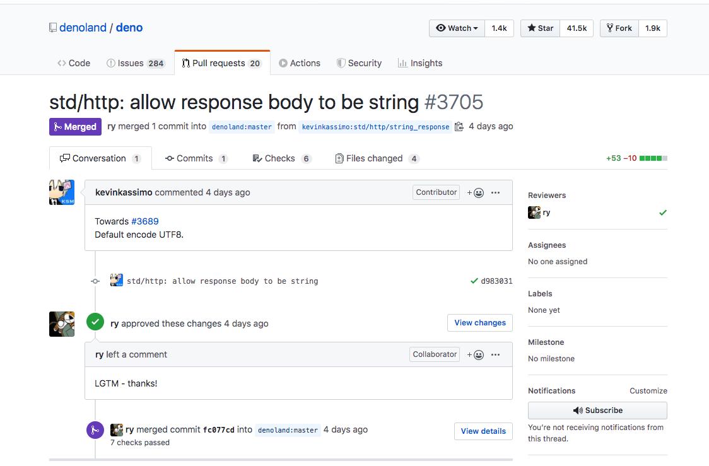

# Od Node.js<br>do Deno

<br>

Nowoczesny backendowy runtime <br>
dla JavaScript i TypeScript na rok 2020

---

# Rafał Pocztarski

Możecie mnie znać ze Stack Overflow

[](https://stackoverflow.com/users/613198/rsp)

# pocztarski.com

<small>(oraz z GitHuba, Medium, Quora, etc.)</small>

---

# Slajdy

<big><big> [pocztarski.com/ondd](https://pocztarski.com/ondd) </big></big>

Przykłady

[github.com/rsp/ondd/tree/ondd](https://github.com/rsp/ondd/tree/ondd)

---

evented I/O for v8 javascript

---

A secure TypeScript runtime on V8

---

# Architektura 

Node = Server-side JS (V8 + libuv w C++)

Deno = Server-side TS (V8 + Tokio w Rust)

---

# Podejście

“The only thing that matters in software<br>is the experience of the user.”<br><br>- Ryan Dahl

---

# Historia

2009 Node.js

2012 TypeScript

2015 ts-node

2018 Deno

---

# Instalacja

Dla odważnych:<br><small>
`curl -fsSL https://deno.land/x/install/install.sh | sh`<br>
`iwr https://deno.land/x/install/install.ps1 | iex` </small>

Dla rozważnych:<br>
[github.com/denoland/deno/releases](https://github.com/denoland/deno/releases)

---

# DENO.LAND

---

# Użycie

```bash
deno run script.ts
```

```bash
deno run https://pocztarski.com/hi.ts
```

---

# Program

```bash
$ curl https://pocztarski.com/hi.ts
```

```ts
import { hello } from './hello.ts';

hello('DevDuck');
```

---

# Biblioteka

```bash
$ curl https://pocztarski.com/hello.ts
```

```ts
export function hello(name: string = 'world'): void {
  console.log(`Hello, ${name}!`);
}
```

---

# Pierwsze uruchomienie

```bash
$ deno run https://pocztarski.com/hi.ts
```

```text
Download https://pocztarski.com/hi.ts
Compile https://pocztarski.com/hi.ts
Download https://pocztarski.com/hello.ts
Hello, DevDuck!
```

---

# Ponowne uruchomienie

```bash
$ deno run https://pocztarski.com/hi.ts
```

```text
Hello, DevDuck!
```

---

# Bezpieczeństwo

```bash
deno run --allow-write script.ts
```

```bash
deno run --allow-net script.ts
```

---

# Uprawnienia

Domyślnie brak dostępu do sieci i dysku

```text
-A, --allow-all                  all permissions
    --allow-env                  environment access
    --allow-hrtime               high resolution time measurement
    --allow-net=<allow-net>      network access
    --allow-read=<allow-read>    file system read access
    --allow-run                  running subprocesses
    --allow-write=<allow-write>  file system write access
```

---

# Przykłady

```bash
$ deno run --allow-read=/etc/file.txt script.ts
```

```bash
$ deno run --allow-write=/tmp script.ts
```

```bash
$ deno run --allow-net script.ts
```

---

# Biblioteki

- [deno.land/typedoc](https://deno.land/typedoc/)
- [deno.land/std](https://deno.land/std/)
- [deno.land/x](https://deno.land/x/)

---

# Użycie bibliotek

(z błędem)

```bash
$ cat example1.ts
```
```ts
import { rand } from 'https://deno.land/x/rand/mod.ts';

const x = rand.r8(); // error

console.log(x);
```

---

# TypeScript w akcji

```bash
$ deno run example1.ts
```
```text
Compile file:///Users/rsp/talks/git/ondd/example1.ts
error TS2339: Property 'r8' does not exist on type ...

► file:///Users/rsp/talks/git/ondd/example1.ts:3:16

3 const x = rand.r8(); // error
                 ~~
```

---

# Użycie bibliotek

```bash
$ cat example2.ts
```
```ts
import { rand } from 'https://deno.land/x/rand/mod.ts';

const x = rand.s8();

console.log(x);
```

---

# Uruchomienie

```bash
$ deno run example2.ts
```
```text
-58
```

---

# Serwer

```ts
import { serve } from 'https://deno.land/std@v0.28.0/http/server.ts';

let n = 0;

const encoder = new TextEncoder();
const server = serve(':8000');
console.log('Listening on http://localhost:8000/');

for await (const req of server) {
  const message = `Hello #${++n}, DevDuck!\n`;
  req.respond({ body: encoder.encode(message) });
}
```

---

[](https://github.com/denoland/deno/pull/3705)

---

# Framework Oak

```ts
import { Application } from 'https://deno.land/x/oak/mod.ts';

const app = new Application();

let n = 1;

app.use(ctx => {
  ctx.response.body = { greeting: `Hello #${++n}, DevDuck!` };
});

app.listen('localhost:8000');

console.log('Listening on http://localhost:8000/');
```

---

# Brak uprawnień

```bash
$ deno run --reload example4.ts 
```
```text
Compile file:///Users/rsp/talks/git/ondd/example4.ts
Download https://deno.land/x/oak/mod.ts
Download https://deno.land/x/oak/application.ts
Download https://deno.land/x/oak/context.ts
[...]
Download https://deno.land/x/oak/pathToRegExp.ts
Listening on http://localhost:8000/
error: Uncaught PermissionDenied: run again with the --allow-net flag
► $deno$/dispatch_json.ts:40:11
    at DenoError ($deno$/errors.ts:20:5)
    at unwrapResponse ($deno$/dispatch_json.ts:40:11)
    at sendSync ($deno$/dispatch_json.ts:67:10)
    at listen ($deno$/net.ts:179:15)
    at serve (server.ts:487:20)
    at listen (application.ts:33:25)
    at example4.ts:11:5
```

---

# Uruchomienie serwera

```bash
$ deno run --allow-net example4.ts 
```
```text
Listening on http://localhost:8000/
```

---

# Stan obecny

v0.30

- Wciąż niestabilne API
- Dużo niekompatybilnych zmian
- Architektura dyskutowana na GitHubie

Czyli najlepszy czas, żeby się zaangażować

---

# Skazany na sukces

1. Ryan Dahl (znany z sukcesu Node.js)
2. V8 (Google)
3. TypeScript (Microsoft)
4. Rust (Mozilla)

---

# Moja prognoza

- Każdy będzie czekać aż Deno będzie "gotowe"
- Nagle wszyscy zaczną szukać Deno Developerów

(Tak jak było z Node.js)

---

# Importowanie URLi

Nie trzeba instalować zależności

---

# Uruchamianie zdalnych skryptów

Nie trzeba instalować narzędzi

---

# Dynamic imports<br>top level await

```ts
const { hello } = await import('https://pocztarski.com/hello.ts');

hello();
```

---

# Brak uprawnień kiedyś

```bash
$ deno run hi2.ts
```
```text
Compile file:///Users/rsp/talks/deno/git/wid/hi2.ts
Download https://pocztarski.com/hello.ts
️⚠️  Deno requests network access to "https://pocztarski.com/hello.ts". Grant?
[a/y/n/d (a = allow always, y = allow once, n = deny once, d = deny always)] y
Hello, world!
```

---

# Brak uprawnień teraz

```bash
$ deno run hi2.ts
```
```text
Compile file:///Users/rsp/talks/git/ondd/hi2.ts
error: Uncaught TypeError: run again with the --allow-net flag
```

---

# Uruchomienie z uprawnieniami

```bash
$ deno run --allow-net=pocztarski.com hi2.ts
```
```text
Hello, world!
```

---

# Pliki

Do 18.01.2020 - całość w przykładzie serve.ts
```ts
for await (const req of server) {
  console.log(`${req.method} ${req.url}`);
  if (req.method === 'GET') {
    try {
      req.respond({ body: await Deno.readFile(`.${req.url}`) });
    } catch (e) {
      console.log(e);
      req.respond({ status: 404, body: encoder.encode('Not Found') });
    }
  } else {
    req.respond({ status: 405, body: encoder.encode('Method Not Allowed') });
  }
}
```

---

# Pliki

Od 18.01.2020 - całość w przykładzie serve2.ts
```ts
for await (const req of server) {
  console.log(`${req.method} ${req.url}`);
  if (req.method === 'GET') {
    try {
      req.respond({ body: await Deno.readFile(`.${req.url}`) });
    } catch (e) {
      console.log(e);
      req.respond({ status: 404, body: 'Not Found' });
    }
  } else {
    req.respond({ status: 405, body: 'Method Not Allowed' });
  }
}
```

---

# TextEncoder

[deno.land/x/ende](https://deno.land/x/ende/)
useless since Deno 0.30

```ts
// Copyright (c) 2019 Rafał Pocztarski. All rights reserved.
// MIT License (Expat). See: https://github.com/rsp/deno-ende

const encoder = new TextEncoder();
const decoder = new TextDecoder();

export const en = (x: string) => encoder.encode(x);
export const de = (x: Uint8Array) => decoder.decode(x);

export const enc = en;
export const dec = de;

export const encode = en;
export const decode = de;
```

---

# Uruchamianie serwera

Kiedyś:

```bash
$ deno run --allow-net=:8000 --allow-read=./dir --no-prompt serve.ts 
```

Teraz:

```bash
$ deno run --allow-net=:8000 --allow-read=`pwd`/dir serve.ts 
```

---

# WebAssembly

```bash
$ cat factorial.c
```

```c
int factorial(int n) {
  return n < 1 ? 1 : n * factorial(n - 1);
}
```

Emscripten: https://emscripten.org/

WasmFiddle: https://wasdk.github.io/WasmFiddle/

WebAssembly Studio: https://webassembly.studio/

---

# WebAssembly<br>w Deno

```ts
const mod = new WebAssembly.Module(await Deno.readFile('program.wasm'));

const { exports: { factorial } } = new WebAssembly.Instance(mod);

console.log(factorial(10));
```

---

# Deno z WebAssembly

Kiedyś:

```bash
$ deno run --allow-read=program.wasm wasm.ts 
3628800
```

Teraz:

```bash
$ deno run --allow-read=`pwd`/program.wasm wasm.ts
3628800
```

---

# WebAssembly

<small>
WebAssembly: https://webassembly.org/
<br>Emscripten: https://emscripten.org/
<br>AssemblyScript: https://assemblyscript.org/
<br>WasmFiddle: https://wasdk.github.io/WasmFiddle/
<br> WebAssembly Studio: https://webassembly.studio/
<br>WebAssembly Binary Toolkit: https://github.com/WebAssembly/wabt
</small>

Języki kompilowane do WebAssembly: https://github.com/appcypher/awesome-wasm-langs

---

Języki kompilowane do WebAssembly

.Net,
AssemblyScript,
Astro,
Brainfuck,
C,
C#,
C++,
Clean,
D,
Elixir,
F#,
Faust,
Forest,
Forth,
Go,
Grain,
Haskell,
Java,
JavaScript,
Julia,
Idris,
Kotlin/Native,
Kou,
Lua,
Lys,
Nim,
Ocaml,
Perl,
PHP,
Plorth,
Poetry,
Python,
Prolog,
Ruby,
Rust,
Scheme,
Scopes,
Speedy.js,
Swift,
Turboscript,
TypeScript,
Wah,
Walt,
Wam,
Wracket,
Xlang,
Zig

https://github.com/appcypher/awesome-wasm-langs

---

# Biblioteki

Wbudowane API: https://deno.land/typedoc/

Standard Modules: https://deno.land/std/

Third Party Modules: https://deno.land/x/

---

# Zalety

1. Łatwa instalacja
2. Łatwy development
3. Domyślnie bezpieczne
4. Precyzyjne przywileje
5. Wbudowany TypeScript
6. Nowoczesna składnia
7. Webowe standardy
8. API oparte na async/await

---

# Prelekcje

<small>
- [Ryan Dahl: Original Node.js presentation (2009)](https://www.youtube.com/watch?v=ztspvPYybIY)
- [History of Node.js by Ryan Dahl (2011)](https://www.youtube.com/watch?v=SAc0vQCC6UQ)
- [10 Things I Regret About Node.js by Ryan Dahl (2018)](https://www.youtube.com/watch?v=M3BM9TB-8yA)
- [Deno, A New Server-Side Runtime by Ryan Dahl (2018)](https://www.youtube.com/watch?v=FlTG0UXRAkE)
- [From Node.js to Deno by Rafał Pocztarski (2019)](https://www.youtube.com/watch?v=Aib1OZLy0_c&t=5s)

</small>

---

# Dokumentacja

- https://deno.land/manual.html
- https://deno.land/typedoc/
- https://deno.land/std/
- https://deno.land/x/
- https://www.typescriptlang.org/

---

# Więcej informacji

- https://deno.land/
- https://deno.news/
- https://denowarsaw.com/
- https://denopoland.com/

---

# Podsumowanie

Deno to runtime dla JavaScript/TypeScript<br>
Cały runtime to pojedynczy plik<br>
Sam runtime nie ma zależności<br>
Importuje i wykonuje URLe<br>
Wspiera dynamiczne importy<br>
Wspiera top-level await<br>
Dostarcza ograniczony sandbox

---

# Dziękuję!

Slajdy: https://pocztarski.com/ondd

## Rafał Pocztarski<br>[pocztarski.com](https://pocztarski.com)

<!-- [][youracclaim-url] -->
[][stackexchange-url]
[][github-follow-url]
[][twitter-follow-url]

[][twitter-url]
[][medium-url]
[][facebook-url]
[][googleplus-url]
[][linkedin-url]
[][angellist-url]
[][instagram-url]
[][flickr-url]
[][codepen-url]
[][github-url]
[][stackexchange-url]
[][stackoverflow-url]

[github-follow-url]: https://github.com/rsp
[github-follow-img]: https://img.shields.io/github/followers/rsp.svg?style=social&label=Follow
[twitter-follow-url]: https://twitter.com/intent/follow?screen_name=pocztarski
[twitter-follow-img]: https://img.shields.io/twitter/follow/pocztarski.svg?style=social&label=Follow
[stackoverflow-url]: https://stackoverflow.com/users/613198/rsp
[stackexchange-url]: https://stackexchange.com/users/303952/rsp
[stackexchange-img]: https://stackexchange.com/users/flair/303952.png
[linkedin-url]: https://www.linkedin.com/in/pocztarski)
[facebook-url]: https://www.facebook.com/pocztarski
[twitter-url]: https://twitter.com/pocztarski
[github-url]: https://github.com/rsp
[medium-url]: https://medium.com/pocztarski
[flickr-url]: https://www.flickr.com/photos/pocztarski/
[instagram-url]: https://www.instagram.com/pocztarski/
[googleplus-url]: https://plus.google.com/106457556668508404492/about
[npm-url]: https://www.npmjs.com/~rsp
[youracclaim-url]: https://www.youracclaim.com/user/pocztarski
[angellist-url]: https://angel.co/pocztarski
[codepen-url]: https://codepen.io/rsp/
